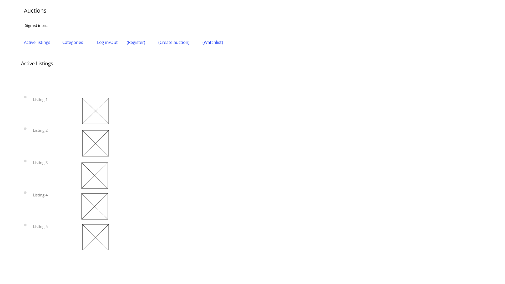

# Design document
## Application workflow
- Active listings: The user can see what listings are active by clicking the link at the top of the page.
- Categories: the user can go to an overview of all the categories by clicking the link on top of the page.
- The user can go to the category page: a page of all the listings within a certain category, from the Categories page mentioned above.
- Listing page: The user can go to the page of a certain listing from either the active listings page, the page of a certain category or the users watchlist page. 
- The user can go to the login page, the register page, the create auction page and his watchlist page by clicking the link at the top of the page. If the link is visable sometimes depends on whether the user is logged in.

## Models needed for application
- Users
- Auctions
- Bids
- Comments
- Categories

## Database info needed per page
- Active listings
- Category list
- Category page
- Listing page
- Login page
- Register page
- Create auction page
- Watchlist page

## Arrow diagram

## Active listings

## Categories

## Category page

## Listing page

## Login page

## Register page

## Create auction

## Watchlist

